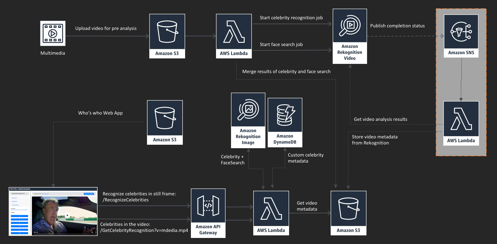

# Build Who's Who App

In this module we will build an end to end solution like Prime Video X-Ray to recognize mainstream and custom celebrities. We use RecognizeCelebrities and SearchFacesByImage APIs to recognize mainstream and custom celebrities. We will also demonstrate how to analyze a video using Rekognition and identify people in it.

## Pre-requisites
This module requires completion of previous modules:
 - [Celebrity Recognition](../1-celebrity-recognition)
 - [Recognize Custom Celebrities](../2-recognize-custom-celebrities)

:warning: **Make sure you use the same region you used for first two modules.**

### Create S3 Bucket

1. Go to S3 in AWS Console at https://s3.console.aws.amazon.com/s3/
2. Click on Create bucket
3. Under Name and region:
  - Bucket name: Enter a bucket name
  - Choose same region you used for earlier two modules
  - Click Next.
4. Leave default values for following steps and on last screen click Create bucket

### Create Lambda Function (to analyze video for celebrities)

1. Go to Lambda in AWS Console at https://console.aws.amazon.com/lambda/
2. Click on Create function.
3. Under Create function, Author from scratch should be selected as default
4. Under Author from scratch:
  - Name: reinvent-video-analysis
  - Runtime: Python 3.6
  - Role: Choose and existing role
  - Existing role: celebrity-recognition-LambdaRole-xxxxxxxxx
  - Click Create function

5. Copy code from [lambda-video-analysis.py](./code/lambda-video-analysis.py) and replace code under Function code
6. Set timeout to 15 minutes. and click save
7. Under Add triggers, select S3
9. Under Configure triggers:
  - Bucket: Select the S3 bucket you just created in earlier step
  - Event type: Leave default Object Created (All)
  - Leave defaults for Prefix and Suffix and make sure Enable trigger checkbox is checked
  - Click Add.
  - Click Save on the top right to save changed to Lambda function

### Analyze Test video
1. Download [media.mp4](./assets/media.mp4)
2. Go to S3 in AWS Console at https://s3.console.aws.amazon.com/s3/
3. Go to S3 bucket you created earlier, and upload media.mp4 you just downloaded
4. This will trigger lambda function and you should see a JSON file will appear in the bucket in few minutes.
5. You can continue to next step and in few minutes refresh your S3 bucket to make sure you get the JSON file.

### Create Lambda Function (to analyze image for celebrities or return pre-analyzed results for video)

1. Go to Lambda in AWS Console at https://console.aws.amazon.com/lambda/
2. Click on Create function.
3. Under Create function, Author from scratch should be selected as default
4. Under Author from scratch:
  - Name: reinvent-celebrity-recognition
  - Runtime: Python 3.6
  - Role: Choose and existing role
  - Existing role: celebrity-recognition-LambdaRole-xxxxxxxxx
  - Click Create function
5. Under Environment variables, add a variable:
  - Key: s3_bucket
  - Value: Name of S3 bucket you created earlier
6. Under Basic settings:
  - Set Timeout to 10 seconds
7. Download [lambda-celebrity-recognition.zip](./code/lambda-celebrity-recognition.zip)
8. Under Function code:
  - Code entry type: Upload a zip file
  - Under Function package, click Upload and select the zip file you downloaded in earlier step
  - Click Save.
9. Click on dropdown next to Test, and click on Configure test events
  - For Event name: enter apigateway
  - Replace sample JSON with JSON from [lambda-test-event.json](./code/lambda-test-event.json)
  - Click Create
10. Click Test. If everything is setup correctly, you should see a response with recognized celebrity name.

### API Gateway

1. Go to API Gateway in AWS Console at https://console.aws.amazon.com/apigateway/
2. Click on Get Started (if this is first time in API GW Console) or Click on Create API
3. Select Import from Swagger or Open API 3
4. Copy code from [apigateway.yaml](./code/apigateway.yaml) and paste it in the text box
5. For EndPoint Type: Select Edge Optimized and click Import.
6. Under /GetCelebrityRecognition:
    - Click on GET
    - Click on Integration Request
    - Update Lambda Region to your region (if needed). Make sure to click on small check icon to save the selected value
    - Lambda Function: Click on edit icon, and start typing name of your lambda function "reinvent-celebrity-recognition". As it appears in the list, select the lambda function.
    - Click on small check icon to save the selected value
    - Click OK on the prompt to add permission to Lambda function.
7. Under /RecognizeCelebrities
    - Click POST
    - Click on Integration Request
    - Update Lambda Region to your region (if needed). Make sure to click on small check icon to save the selected value
    - Lambda Function: Click on edit icon, and start typing name of your lambda function "reinvent-celebrity-recognition". As it appears in the list, select the lambda function.
    - Click on small check icon to save the selected value
    - Click OK on the prompt to add permission to Lambda function.
8. Under reinvent-celebrity-recognition
    - Click ANY
    - Click on Integration Request
    - Update Lambda Region to your region (if needed). Make sure to click on small check icon to save the selected value
    - Lambda Function: Click on edit icon, and start typing name of your lambda function "reinvent-celebrity-recognition". As it appears in the list, select the lambda function.
    - Click on small check icon to save the selected value
    - Click OK on the prompt to add permission to Lambda function

9. Click on Action, and then Deploy API.
10. Click on dropdown for Deployment stage and click New Stage
11. For Stage name: Enter prod and click Deploy.
12. Make note of Invoke URL as you will need this in later step

### Web UI
1. Download [xray.html](./code/xray.html).
2. Update API endpoint with the invoke URL of your API Gateway endpoint that you create earlier
3. Upload modified xray.html to you S3 bucket where you uploaded media.mp4 in earlier step
4. From S3 bucket, click on xray.html to view it in browser
4. Play video and click on Recognize Celebrities to get information about celebrities in realtime
5. Under Video Analysis, see output of pre-analyzed video

